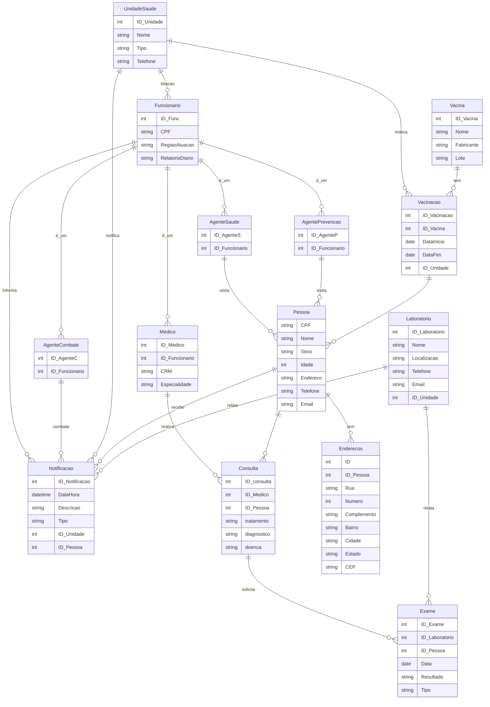
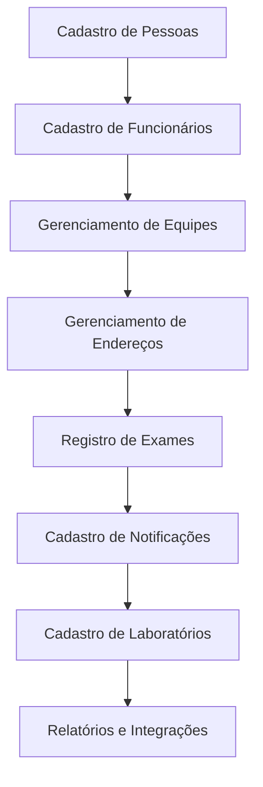

# Proposta de Projeto: Sistema de Banco de Dados para o Setor de Epidemiologia

## Sumário

1. [Introdução](#introdução)
2. [Escopo do Projeto](#escopo-do-projeto)
3. [Requisitos do Sistema](#requisitos-do-sistema)
4. [Modelagem de Dados](#modelagem-de-dados)
5. [Diagrama de Conceito](#diagrama-de-conceito)
6. [Diagrama de Fluxo](#diagrama-de-fluxo)
7. [Próximos Passos](#próximos-passos)

---

## Introdução

Este projeto tem como objetivo desenvolver um banco de dados robusto para o setor de epidemiologia, que permita o gerenciamento eficiente de dados relacionados à saúde pública. O sistema será capaz de cadastrar e gerenciar informações sobre pessoas, funcionários, unidades de saúde, vacinas, laboratórios, exames, consultas, notificações e ações realizadas pelos agentes de saúde.

## Escopo do Projeto

O escopo do projeto inclui:

- **Cadastro e gerenciamento de pessoas e funcionários.**
- **Registro de exames, consultas e notificações.**
- **Gerenciamento de vacinas e campanhas de vacinação.**
- **Integração com laboratórios para registro de exames.**
- **Gerenciamento de unidades de saúde e suas atividades.**
- **Monitoramento de ações realizadas por agentes de saúde.**

## Requisitos do Sistema

### Funcionalidades

1. **Cadastro de Pessoas:**
   - ID único.
   - Nome completo.
   - CPF.
   - Idade.
   - Endereço.
   - Telefone e email.

2. **Cadastro de Funcionários:**
   - ID único.
   - CPF (referência à pessoa cadastrada).
   - Região de atuação.
   - Relatórios diários de atividades.

3. **Gerenciamento de Unidades de Saúde:**
   - ID único da unidade.
   - Nome da unidade.
   - Tipo (hospital, clínica, posto de saúde).
   - Telefone e localização.

4. **Cadastro de Notificações:**
   - ID único.
   - Data e hora.
   - Descrição e tipo da notificação.
   - Origem (unidade de saúde, laboratório, agente de saúde).
   - Referências à pessoa e unidade de saúde.

5. **Registro de Exames:**
   - ID único.
   - Data do exame.
   - Resultado do exame.
   - Tipo de exame.
   - Referências à pessoa e laboratório.

6. **Gerenciamento de Consultas:**
   - ID único.
   - Data da consulta.
   - Diagnóstico.
   - Tratamento.
   - Referências à pessoa e médico.

7. **Gerenciamento de Vacinas e Campanhas de Vacinação:**
   - ID único da vacina.
   - Nome da vacina.
   - Fabricante e lote.
   - Registro de campanhas de vacinação com início e fim.

8. **Cadastro de Laboratórios:**
   - ID único.
   - Nome do laboratório.
   - Localização.
   - Telefone e email.
   - Referência à unidade de saúde.

### Não Funcionais

- **Segurança:** Proteção dos dados sensíveis.
- **Escalabilidade:** Capacidade de crescer com a demanda.
- **Integração:** Comunicação eficiente com sistemas externos.

## Modelagem de Dados

### Tabela `Pessoas`

| Campo        | Tipo de Dado  | Descrição                            |
|--------------|---------------|--------------------------------------|
| ID           | Inteiro       | Identificador único da pessoa        |
| Nome         | Texto         | Nome completo da pessoa              |
| CPF          | Texto         | CPF da pessoa                        |
| Sexo         | Texto         | Sexo da pessoa                       |
| Idade        | Inteiro       | Idade da pessoa                      |
| Endereço     | Texto         | Endereço da pessoa                   |
| Telefone     | Texto         | Telefone de contato                  |
| Email        | Texto         | Email de contato                     |

### Tabela `Funcionários`

| Campo           | Tipo de Dado  | Descrição                             |
|-----------------|---------------|---------------------------------------|
| ID Func         | Inteiro       | Identificador único do funcionário    |
| CPF             | Texto         | CPF da pessoa                         |
| Região Atuação  | Texto         | Região onde o funcionário atua        |
| Relatório Diario| Texto         | Relatório das atividades diárias      |

### Tabela `Unidades de Saúde`

| Campo        | Tipo de Dado  | Descrição                            |
|--------------|---------------|--------------------------------------|
| ID_Unidade   | Inteiro       | Identificador único da unidade       |
| Nome         | Texto         | Nome da unidade                      |
| Tipo         | Texto         | Tipo da unidade (hospital, clínica)  |
| Telefone     | Texto         | Telefone de contato                  |
| Localização  | Texto         | Endereço da unidade                  |

### Tabela `Notificações`

| Campo              | Tipo de Dado  | Descrição                           |
|--------------------|---------------|-------------------------------------|
| ID_Notificação     | Inteiro       | Identificador único da notificação  |
| DataHora           | Data e Hora   | Data e hora da notificação          |
| Descrição          | Texto         | Detalhes da notificação             |
| Tipo               | Texto         | Tipo da notificação                 |
| ID_Unidade         | Inteiro       | Referência à unidade de saúde       |
| ID_Pessoa          | Inteiro       | Referência à pessoa relacionada     |

### Tabela `Consultas`

| Campo              | Tipo de Dado  | Descrição                           |
|--------------------|---------------|-------------------------------------|
| ID_Consulta        | Inteiro       | Identificador único da consulta     |
| ID_Médico          | Inteiro       | Referência ao médico responsável    |
| ID_Pessoa          | Inteiro       | Referência à pessoa consultada      |
| Diagnóstico        | Texto         | Diagnóstico realizado               |
| Tratamento         | Texto         | Tratamento prescrito                |
| Doença             | Texto         | Doença diagnosticada                |

### Tabela `Exames`

| Campo              | Tipo de Dado  | Descrição                           |
|--------------------|---------------|-------------------------------------|
| ID_Exame           | Inteiro       | Identificador único do exame        |
| ID_Laboratório     | Inteiro       | Referência ao laboratório           |
| ID_Pessoa          | Inteiro       | Referência à pessoa relacionada     |
| Data               | Date          | Data do exame                       |
| Resultado          | Texto         | Resultado do exame                  |
| Tipo               | Texto         | Tipo de exame                       |

### Tabela `Vacinas`

| Campo              | Tipo de Dado  | Descrição                           |
|--------------------|---------------|-------------------------------------|
| ID_Vacina          | Inteiro       | Identificador único da vacina       |
| Nome               | Texto         | Nome da vacina                      |
| Fabricante         | Texto         | Fabricante da vacina                |
| Lote               | Texto         | Lote da vacina                      |

### Tabela `Vacinação`

| Campo              | Tipo de Dado  | Descrição                           |
|--------------------|---------------|-------------------------------------|
| ID_Vacinação       | Inteiro       | Identificador único da vacinação    |
| ID_Vacina          | Inteiro       | Referência à vacina                 |
| DataInicio         | Date          | Data de início da campanha          |
| DataFim            | Date          | Data de fim da campanha             |
| ID_Unidade         | Inteiro       | Referência à unidade de saúde       |

### Tabela `Laboratórios`

| Campo             | Tipo de Dado  | Descrição                           |
|-------------------|---------------|-------------------------------------|
| ID_Laboratório    | Inteiro       | Identificador único do laboratório  |
| Nome              | Texto         | Nome do laboratório                 |
| Localização       | Texto         | Localização do laboratório          |
| Telefone          | Texto         | Telefone de contato                 |
| Email             | Texto         | Email de contato                    |
| ID_Unidade        | Inteiro       | Referência à unidade de saúde       |

## Diagrama de Conceito

## Diagrama de Fluxo

## Próximos Passos

1. **Revisão de Requisitos:** Confirmar os detalhes com as partes interessadas.
2. **Modelagem Detalhada:** Criar diagramas de entidade-relacionamento (ERD) e diagramas de fluxo de dados.
3. **Implementação:** Desenvolver o banco de dados e a interface de usuário.
4. **Testes e Validações:** Garantir que todos os componentes funcionem corretamente.
5. **Treinamento e Implantação:** Treinar a equipe e implementar o sistema.
6. **Manutenção:** Fornecer suporte contínuo e atualizações conforme necessário.
